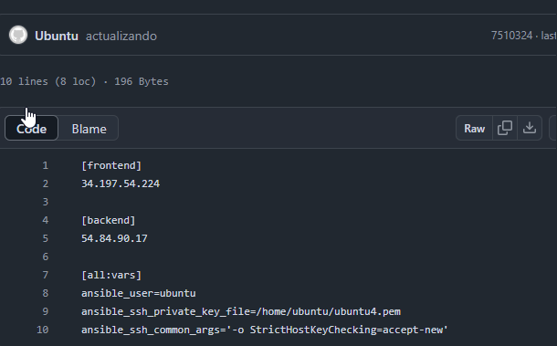
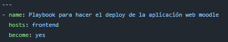
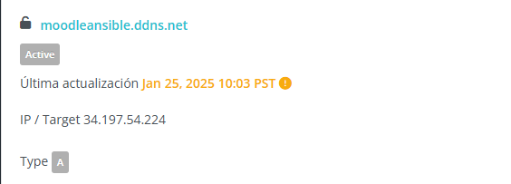
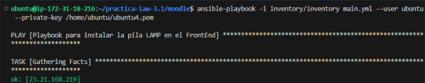
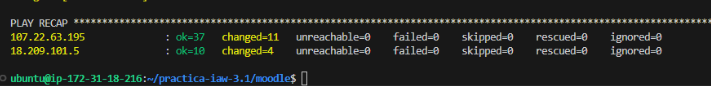
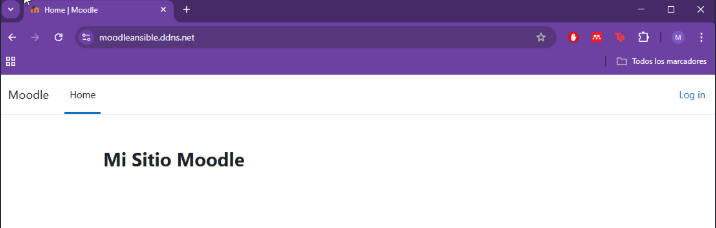
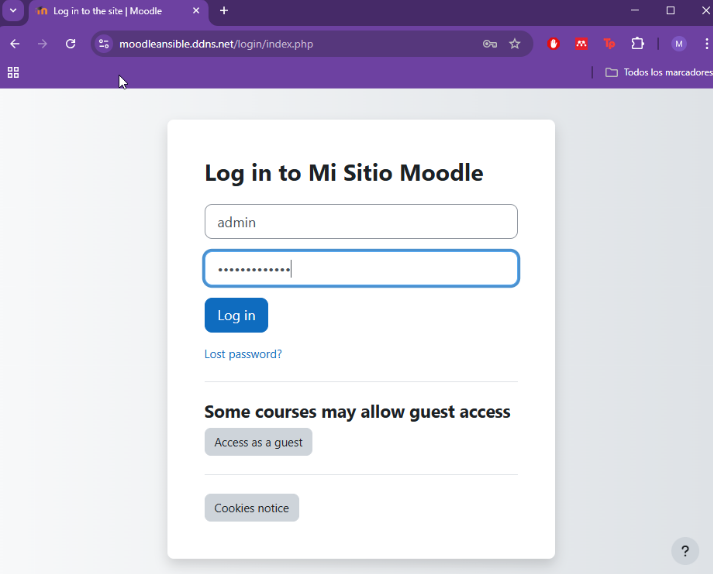
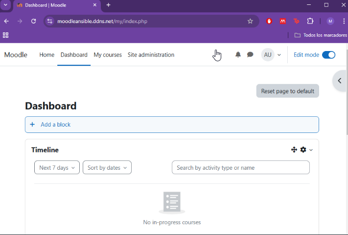

# practica-iaw-3.1
# Implantación de Moodle en AWS mediante Ansible

## 1. Introducción
En esta práctica, el objetivo es automatizar una instalación de Moodle utilizando una arquitectura de dos niveles, backend y frontend, en Amazon Web Services con Ansible.

Para ello crearemos 2 maquinas como en la [actividad 1.8](https://github.com/marinaferb92/practica-iaw-1.8.git) 

tendremos que tener en cuentas las ips de cada maquina para definirlas dentro del inventario de Ansible

En cada playboock deberemos definir en que maquina queremos que se ejecuten los cambios 

tambien tendremos que tener nuestro dominio definido con la ip publica del balanceador para definirla dentro del archivo de variables [variables.yml](moodle/vars/variables.yml)

Una vez hecho esto ejecutamos [main.yml](moodle/main.yml), donde tendremos puestos todos los playbooks en el orden de ejecución que queremos, con el comando `ansible-playbook + la ruta de nuestro inmventario + nuesto usuario + nuestra ruta a la clave vockey`, comenzaremos a ejecutar los playbooks.

Una vez terminado nos dará un resumen de los cambios que ha realizado

Una vez hecho esto podremos entrar en nuestro moodle y entrando en el administrador con las claves predefinidas en las variables, podremos comenzar a configurarlo.

