# practica-iaw-4.5

# Terraform

Terraform es una infraestructura que nos permite de forma automatizada crear, modificar y eliminar infraestructuras.
En esta practica vamos a hacerlo gestionando el servicio de AWS.

Para empezar, instalaremos Terraform como se nos indica en la guía oficial [guia oficial de terraform](https://developer.hashicorp.com/terraform/tutorials/aws-get-started/install-cli).
Tambien deberemos instalar la herramienta de AWS cli y configurar nuestras credenciales de acceso utilizando el comando 
`` aws configure``

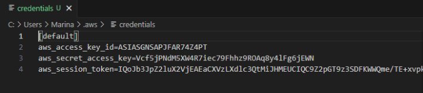

Una vez hecho podremos empezar a **Iniciar el directorio de trabajo** para ello ejecutaremos utilizaremos ``terraform init `` 

Con `terraform fmt` formatean el archivo de configuración para que sea más legible y `terraform validate` validamos el archivo de configuración

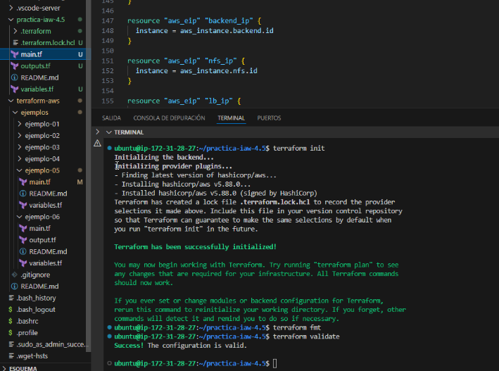

`terraform plan` nos permite ver los cambios que se aplicarán antes de ejecutarlos. 

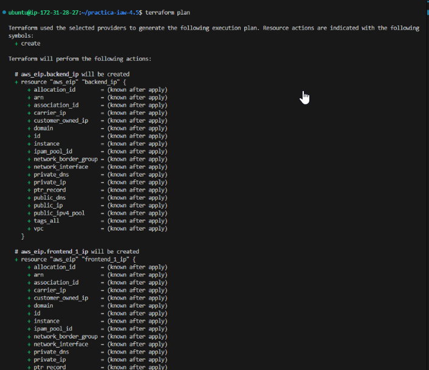

Una vez que tenemos seguridad de que nuestro archivo es correcto ejecutaremos `terraform apply` o `terraform apply -auto-approve, el segundo crea los recursos sin tener que estar confirmando, y veremos como se comienza a desplegar la infraestructura.

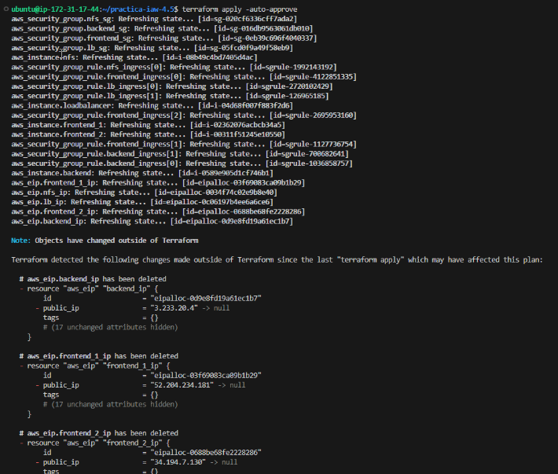

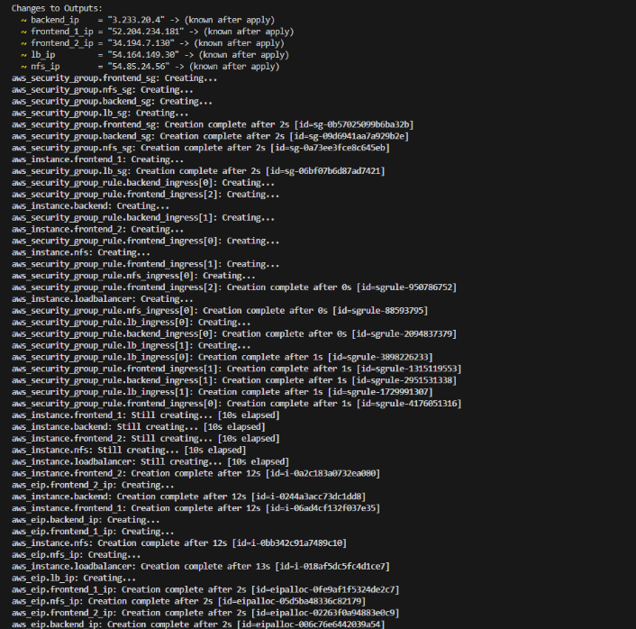

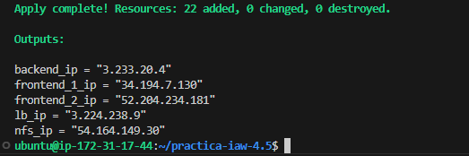

Una vez terminado si entramos en AWS vemos que la infraestructura está creada, con sus grupos de seguridad y las IPs flotantes creadas y asociadas a cada instancia.

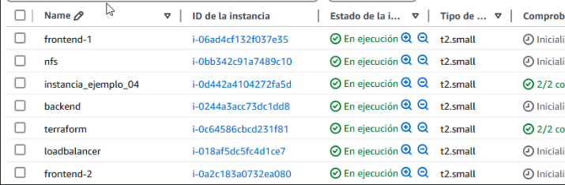

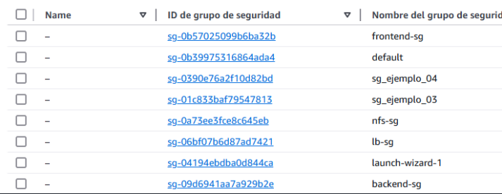

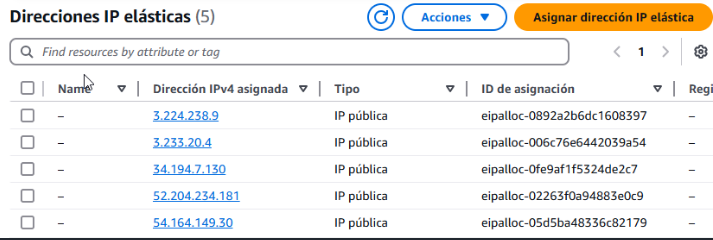

Ejecutando `terraform show` podremos ver los recursos que tenemos creados y su estado

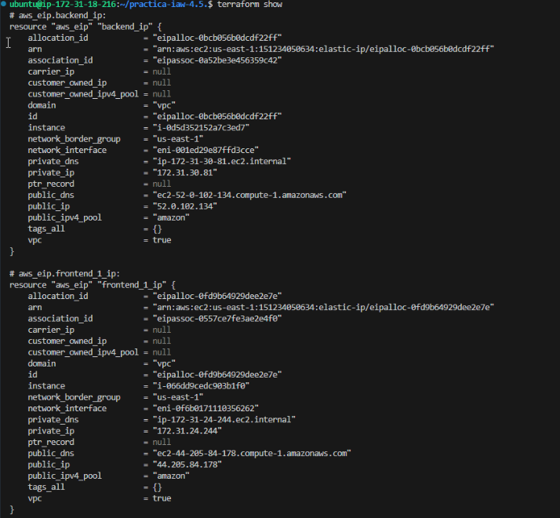

y con `terraform destroy` podremos destruir la infraestructura completa sin necesidad de indicar nada más, al igual que con apply si indicamos *-auto-approve** se eliminará todo sin necesidad de confirmación 

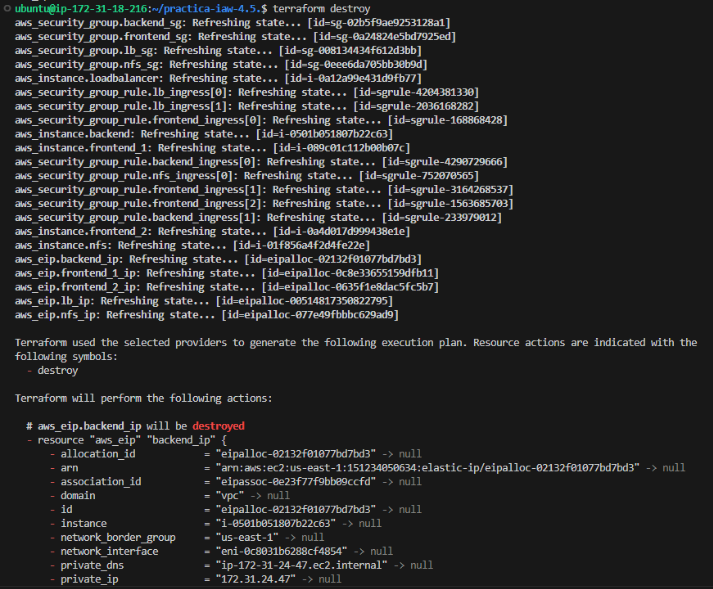

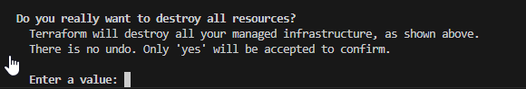

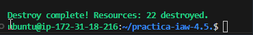
